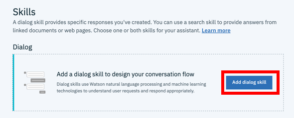
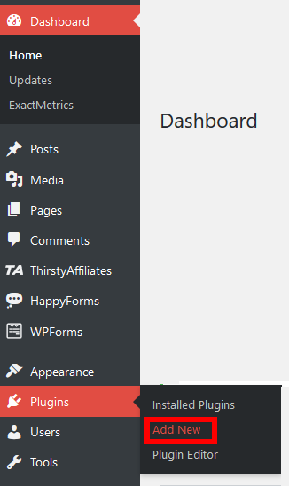

# IBM-Watson-Chatbot-Wordpress
Build your own FAQ chatbot base on IBM Watson and deploy it to your Wordpress site.
## Watson Assistant with Wordpress
This article shows you how to combine the Watson Assistant and Wordpress. It allows visitors to get answers from a list of frequently asked questions.

**Before you begin**

Be sure you you have an IBM Cloud account. If you don't have one, click here (https://cloud.ibm.com/registration ).

**Search and select in the catalog "Watson Assistant**

  
**Select the region closest to you**

**Select the free plan "Lite" and click on "Create" button**

## First:Launch Watson Assistant service

**In "Dashboard", click on "Service"**

**Select the Watson assistant service. In my case I renamed it**

**Click on "Launch Watson Assistant**

## Second: Create an assistant

**Create a new assistant with an enable preview link**

## Third: Create a dialog skill

**Click on "Add dialog skill"**

**Click on the dialogue skill you created**

## Fourth: Add intents from a content catalog

**On this page before to create your own intents go to "Content catalog"**

**Click "Add skill" for the category "General".**

It allow your chatbot to greet users and end conversations with them.

**Click on "Intents" and create your own by clicking on "Create intent".  Create intentions and combine them with sample examples to form your data. You can also import your intents with a CSV file.**

## Fitth: Create a dialog

A dialog is a structure in the form of a tree that defines the flow of the conversation. It creates links between intents (what the user says) and responses (what the robot says). 

**Click on "Dialog". By default there are two node: "Welcome" and "Anything else".**

**Click "Welcome" and change the default welcome message. When you finished, click on the "x" on the top-left.**
As you can see, this is my welcome message.

**Click on "Add node" to create a new one. Select an intent in "If assistant recognizes" and write the answer in "Assistant responds". When you finished, click on the "x" on the top-left. You can also import your dialog with a JSON file.**

**Click on the "Try it" button to test your chatbot**

## Sixth: Worpress plugin

**Go to your Wordpress site. In the dashboard, go to "Plugins" => "Add new"**

**In the search bar type "Chatbot with IBM Watson"**

**In the menu, select "Watson Assistant" => "Set up Chatbot". Click on the "Plugin Setup" tab and follow the instructions. Click on the "Save change".**

Go and test it on your website. 

